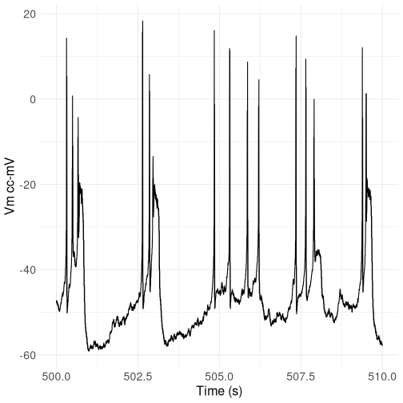
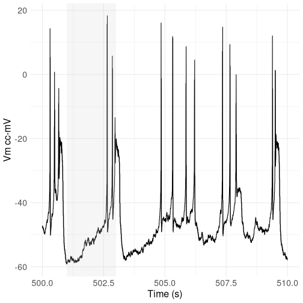
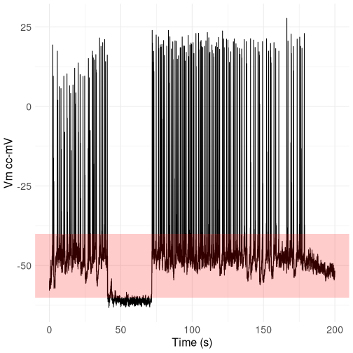

# ABF_plotter.R

This simple script allows plotting data from ABF files using ggplot.

## Required packages

- ggplot2
- readABF

(install with `install.packages(c("ggplot2", "readABF"))`)

## Usage

1. Download the `ABF_plotter.R` script from [this repository](https://github.com/nicolaromano/ABF_plotter/tree/main).
2. Create a new R script in the same directory as the `ABF_plotter.R` script.
3. Load the `ABF_plotter.R` script in your R script using the `source()` function and read the ABF file using the `readABF()` function from the `readABF` package.

```r
library(readABF)
source("ABF_plotter.R")

recording <- readABF("recording.abf")
```

4. You can now plot the data using the `plotABF()` function.


```r
# Plot data from 500 to 510 seconds
plot_ABF_data(recording, sweep=1, channel=1, time_from=500, time_to=510)
```




```r
# As above, but highlight the x range from 501 to 503 seconds
plot_ABF_data(recording, sweep=1, channel=1, time_from=500, time_to=510, highlight_x_range = c(501, 503))
```




```r
# Change the highlight color to red, plot time 200-400s but start the x axis from 0
plot_ABF_data(recording, sweep=1, channel=1, time_from=200, time_to=400, reset_time = TRUE,
    highlight_y_range = c(-60, -40), highlight_color = "red")
```



5. You can also print information about the recording using the `print_ABF_file_info()` function.


```r
print_ABF_file_info(recording)
```

```
## File name:  recording.abf 
##  Number of sweeps:  1 
##  Sweep:  1  - Channels:  Vm cc-mV, Icc-pA 
##  Number of points 28490752  - Duration:  2849.0752 s
```
